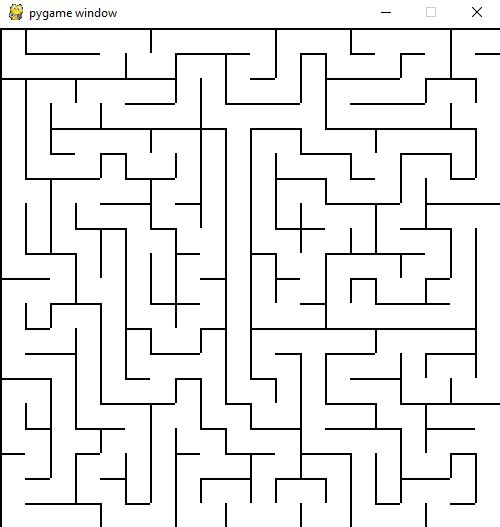

# MazeEngine
Overview 
>*Graphical Application that utilizes a recursive backtracking algorithm to draw a maze, then uses Dijkstra's shortest path finding algorithm to solve the maze every time. 
>*Pygame module was used for the main rendering algorithm 
>*Tkinter module was used for the user prompt window 
>*Enter the size of the maze, press enter to draw, press shift to solve.

Screenshots 

